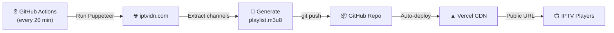

<div align="center">

# 📺 IPTVIDN Playlist

### Auto-updated M3U8 playlist from [iptvidn.com](http://iptvidn.com)


---

**🔗 Playlist URL:**

```
https://your-project.vercel.app/playlist.m3u8
```

*Copy this URL into your favorite IPTV player (VLC, TiviMate, IPTV Smarters, etc.)*

</div>

---

## ✨ Features

- 🔄 **Auto-Updates Every 20 Minutes** — GitHub Actions scrapes the latest channels
- 🌐 **Hosted on Vercel** — Fast, reliable CDN delivery worldwide
- 📋 **Valid M3U8 Format** — Compatible with all major IPTV players
- 🏷️ **Categorized Channels** — Organized by group (Sports, News, Bangla, Hindi, etc.)
- 📦 **Automated Releases** — Weekly GitHub releases with playlist snapshots
- 🛡️ **CORS Enabled** — Works with web-based players too

---

## 🚀 Quick Start

### Option 1: Direct URL
Copy the playlist URL and paste it into your IPTV player:
```
https://your-project.vercel.app/playlist.m3u8
```

### Option 2: Download
Download the latest `playlist.m3u8` from the [Releases](../../releases/latest) page.

### Option 3: Raw GitHub
```
https://raw.githubusercontent.com/YOUR_USERNAME/iptvidn-playlist/main/public/playlist.m3u8
```

---

## 🏗️ Architecture



---

## 🛠️ Tech Stack

| Component | Technology |
|-----------|------------|
| **Scraper** | Node.js + Puppeteer (headless Chrome) |
| **CI/CD** | GitHub Actions (cron schedule) |
| **Hosting** | Vercel (static deployment) |
| **Format** | M3U8 with EXTINF metadata |

---

## 📂 Project Structure

```
iptvidn-playlist/
├── .github/workflows/
│   ├── update-playlist.yml   # 20-min cron update
│   └── release.yml           # Weekly automated release
├── public/
│   ├── playlist.m3u8         # Generated playlist (auto-updated)
│   └── index.html            # Landing page
├── scraper/
│   ├── index.js              # Main scraper orchestrator
│   ├── parser.js             # DOM channel extractor
│   ├── generator.js          # M3U8 file generator
│   └── validate.js           # Playlist validator
├── vercel.json               # Vercel configuration
├── package.json              # Dependencies
├── README.md                 # This file
└── LICENSE                   # MIT License
```

---

## 🔧 Deploy Your Own

### Prerequisites
- [Node.js](https://nodejs.org/) 20+
- [GitHub Account](https://github.com)
- [Vercel Account](https://vercel.com) (connected to GitHub)

### Steps

1. **Fork this repository**

2. **Connect to Vercel:**
   - Go to [vercel.com/new](https://vercel.com/new)
   - Import your forked repository
   - Deploy (zero config needed)

3. **Update badge URLs:**
   - Replace `YOUR_USERNAME` in `README.md` with your GitHub username

4. **Enable GitHub Actions:**
   - Go to your repo → Actions tab → Enable workflows
   - The playlist will start auto-updating every 20 minutes

5. **Update Vercel URL:**
   - Replace `your-project.vercel.app` with your actual Vercel URL

---

## 🧪 Local Development

```bash
# Clone the repo
git clone https://github.com/YOUR_USERNAME/iptvidn-playlist.git
cd iptvidn-playlist

# Install dependencies
npm install

# Run the scraper
npm run scrape

# Validate the playlist
npm test

# Preview on Vercel (optional)
npx vercel dev
```

---

## 📊 Channel Categories

| Category | Description |
|----------|-------------|
| 🏟️ Live Sports | Live sporting events |
| ⚽ Sports | Sports channels |
| 📰 News | News channels |
| 🇧🇩 Bangla | Bangladeshi channels |
| 🇮🇳 Hindi | Hindi language channels |
| 🎬 Movies | Movie channels |
| 🎵 Music | Music channels |
| 🎥 Documentary | Documentary channels |
| 👶 Kids | Children's channels |

---

## ⚠️ Disclaimer

> This project is for **educational and personal use only**.
>
> - All channel streams are sourced from [iptvidn.com](http://iptvidn.com) and are publicly accessible.
> - The content and streams are owned by their respective broadcasters.
> - This project does not host, store, or distribute any copyrighted content.
> - We are not affiliated with iptvidn.com or any of the listed channels.
> - Use at your own risk. We are not responsible for any misuse.

---

## 📄 License

MIT License — see [LICENSE](LICENSE) for details.

---

<div align="center">

**⭐ Star this repo if you find it useful!**

</div>
