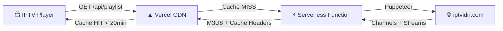

<div align="center">

# 📺 IPTVIDN Playlist

### Auto-updated M3U8 playlist from [iptvidn.com](http://iptvidn.com)


---

**🔗 Playlist URL:**

```
https://iptvidn-playlist.vercel.app/api/playlist
```

*Copy this URL into your favorite IPTV player (VLC, TiviMate, IPTV Smarters, etc.)*

</div>

---

## ✨ Features

- 🔄 **Auto-Updates Every 20 Minutes** — Vercel CDN cache auto-refreshes, no cron needed
- ⚡ **Serverless## 🚀 How it works (The Architecture)

Because `iptvidn.com` heavily blocks cloud and datacenter IP addresses (AWS, Cloudflare, Vercel), it is impossible for Vercel's Edge CDN to scrape the streams directly on request.

To solve this, we use a **Triggered Cloud Worker** architecture:
1. A lightweight Node.js web server runs on **Render** (which has a great free tier with NO credit card required).
2. We use a free cron service (**cron-job.org**) to ping the Render server's `/trigger` endpoint every 20 minutes.
3. Upon receiving the ping, the worker uses `scraper/generate_static.js` to parse `iptvidn.com` and generate `playlist.m3u8`.
4. The worker automatically commits and pushes the updated playlist to this GitHub repository.
5. Vercel (which is linked to your GitHub repo) instantly detects the push and deploys the new static `playlist.m3u8` to its global, high-speed CDN.

Your media players (like VLC) will hit the fast Vercel URL!

## ☁️ How to deploy the Automation Worker (100% Free, No Credit Card)

We will use **Render** to host the worker and **cron-job.org** to trigger it every 20 minutes.

### Step 1: Deploy to Render
1. Go to [Render.com](https://render.com) and sign up (No credit card required).
2. Click **New +** and select **Web Service**.
3. Connect your GitHub account and select your `iptvidn-playlist` repository.
4. Render will automatically detect the `Dockerfile` and Node.js environment.
5. Scroll down to **Environment Variables** and add:
   - Key: `GITHUB_TOKEN`
   - Value: *(Create a Personal Access Token in GitHub Settings -> Developer Settings -> Personal access tokens (classic) with the `repo` scope, and paste it here)*
6. Click **Create Web Service**. 
7. Once deployed, copy your Render app URL (e.g., `https://iptvidn-playlist.onrender.com`).

### Step 2: Set up the 20-Minute Automation Trigger
Because Render's free tier goes to sleep after 15 minutes of inactivity, we will use a free cron service to wake it up and trigger the update every 20 minutes.
1. Go to [cron-job.org](https://cron-job.org) and create a free account.
2. Click **CREATE CRONJOB**.
3. In the URL field, paste your Render app URL and add `/trigger` to the end (e.g., `https://iptvidn-playlist.onrender.com/trigger`).
4. Set the execution schedule to **Every 20 minutes**.
5. Click **Create**.

That's it! Every 20 minutes, cron-job.org will hit your Render app. Render will wake up, scrape the new tokens, push the updated playlist to GitHub, and Vercel will instantly host it!

## 🔗 The Output URL

Once everything is running, you can put this URL into VLC or any IPTV Player:
```
https://iptvidn-playlist.vercel.app/playlist.m3u8
```

### Option 2: Download
Download the latest `playlist.m3u8` from the [Releases](../../releases/latest) page.

```
https://iptvidn-playlist.vercel.app/playlist.m3u8
```

---

## 🏗️ Architecture



### How Auto-Updates Work (No Cron Needed!)

Instead of a cron job, the system uses **Vercel CDN caching** with smart headers:

| Header | Value | Effect |
|--------|-------|--------|
| `s-maxage` | `1200` (20 min) | CDN serves cached response for 20 minutes |
| `stale-while-revalidate` | `600` (10 min) | After 20 min, serves stale while fetching fresh data |

This means:
1. **First request** → Scrapes iptvidn.com, caches result for 20 min
2. **Within 20 min** → Instant response from CDN (no scraping)
3. **After 20 min** → Serves stale immediately, re-scrapes in background
4. **Result** → Always fresh within ~20 min, always fast response

---

## 🛠️ Tech Stack

| Component | Technology |
|-----------|------------|
| **Scraper** | Puppeteer Core + @sparticuz/chromium (serverless headless Chrome) |
| **Backend** | Vercel Serverless Functions (Node.js 20) |
| **Hosting** | Vercel (CDN + static + serverless) |
| **Caching** | Vercel Edge CDN (s-maxage=1200) |
| **Format** | M3U8 with EXTINF metadata |
| **Releases** | GitHub Actions (weekly automated) |

---

## 📂 Project Structure

```
iptvidn-playlist/
├── api/
│   └── playlist.js               # Serverless scraper + M3U8 generator
├── public/
│   ├── playlist.m3u8             # Static fallback playlist
│   └── index.html                # Landing page
├── scraper/
│   └── validate.js               # Playlist validator
├── .github/workflows/
│   └── release.yml               # Weekly automated releases
├── vercel.json                   # Vercel config (functions + headers)
├── package.json                  # Dependencies
├── README.md                     # This file
└── LICENSE                       # MIT License
```

---

## 🔧 Deploy Your Own

### Prerequisites
- [GitHub Account](https://github.com)
- [Vercel Account](https://vercel.com) (connected to GitHub)

### Steps

1. **Fork this repository**

2. **Connect to Vercel:**
   - Go to [vercel.com/new](https://vercel.com/new)
   - Import your forked repository
   - Deploy (zero config needed — `vercel.json` handles everything)

3. **Your playlist URL:**
   ```
   https://your-project.vercel.app/api/playlist
   ```

4. **That's it!** No cron jobs, no environment variables, no external services.

---

## 🧪 Local Development

```bash
# Clone the repo
git clone https://github.com/tahsinulmohsin/iptvidn-playlist.git
cd iptvidn-playlist

# Install dependencies
npm install

# Run locally with Vercel dev
npm run dev

# Access the playlist
curl http://localhost:3000/api/playlist
```

---

## 📊 Channel Categories

| Category | Description |
|----------|-------------|
| 🏟️ Live Sports | Live sporting events |
| ⚽ Sports | Sports channels |
| 📰 News | News channels |
| 🇧🇩 Bangla | Bangladeshi channels |
| 🇮🇳 Hindi | Hindi language channels |
| 🎬 Movies | Movie channels |
| 🎵 Music | Music channels |
| 🎥 Documentary | Documentary channels |
| 👶 Kids | Children's channels |

---

## ⚠️ Disclaimer

> This project is for **educational and personal use only**.
>
> - All channel streams are sourced from [iptvidn.com](http://iptvidn.com) and are publicly accessible.
> - The content and streams are owned by their respective broadcasters.
> - This project does not host, store, or distribute any copyrighted content.
> - We are not affiliated with iptvidn.com or any of the listed channels.
> - Use at your own risk. We are not responsible for any misuse.

---

## 📄 License

MIT License — see [LICENSE](LICENSE) for details.

---

<div align="center">

**⭐ Star this repo if you find it useful!**

</div>
