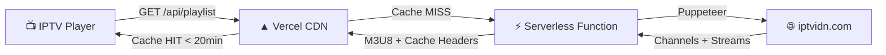

<div align="center">

# 📺 IPTVIDN Playlist

### Auto-updated M3U8 playlist from [iptvidn.com](http://iptvidn.com)


---

**🔗 Playlist URL:**

```
https://iptvidn-playlist.vercel.app/api/playlist
```

*Copy this URL into your favorite IPTV player (VLC, TiviMate, IPTV Smarters, etc.)*

</div>

---

## ✨ Features

- 🔄 **Auto-Updates Every 20 Minutes** — Vercel CDN cache auto-refreshes, no cron needed
- ⚡ **Serverless Powered** — Scrapes on-demand using headless Chrome on Vercel Functions
- 🌐 **Global CDN** — Fast delivery worldwide via Vercel Edge Network
- 📋 **Valid M3U8 Format** — Compatible with all major IPTV players
- 🏷️ **Categorized Channels** — Organized by group (Sports, News, Bangla, Hindi, etc.)
- 📦 **Automated Releases** — Weekly GitHub releases with playlist snapshots
- 🛡️ **CORS Enabled** — Works with web-based players too

---

## 🚀 Quick Start

### Option 1: Direct URL (Recommended)
Copy the playlist URL and paste it into your IPTV player:
```
https://iptvidn-playlist.vercel.app/api/playlist
```

### Option 2: Download
Download the latest `playlist.m3u8` from the [Releases](../../releases/latest) page.

### Option 3: Static Fallback
```
https://iptvidn-playlist.vercel.app/playlist.m3u8
```

---

## 🏗️ Architecture



### How Auto-Updates Work (No Cron Needed!)

Instead of a cron job, the system uses **Vercel CDN caching** with smart headers:

| Header | Value | Effect |
|--------|-------|--------|
| `s-maxage` | `1200` (20 min) | CDN serves cached response for 20 minutes |
| `stale-while-revalidate` | `600` (10 min) | After 20 min, serves stale while fetching fresh data |

This means:
1. **First request** → Scrapes iptvidn.com, caches result for 20 min
2. **Within 20 min** → Instant response from CDN (no scraping)
3. **After 20 min** → Serves stale immediately, re-scrapes in background
4. **Result** → Always fresh within ~20 min, always fast response

---

## 🛠️ Tech Stack

| Component | Technology |
|-----------|------------|
| **Scraper** | Puppeteer Core + @sparticuz/chromium (serverless headless Chrome) |
| **Backend** | Vercel Serverless Functions (Node.js 20) |
| **Hosting** | Vercel (CDN + static + serverless) |
| **Caching** | Vercel Edge CDN (s-maxage=1200) |
| **Format** | M3U8 with EXTINF metadata |
| **Releases** | GitHub Actions (weekly automated) |

---

## 📂 Project Structure

```
iptvidn-playlist/
├── api/
│   └── playlist.js               # Serverless scraper + M3U8 generator
├── public/
│   ├── playlist.m3u8             # Static fallback playlist
│   └── index.html                # Landing page
├── scraper/
│   └── validate.js               # Playlist validator
├── .github/workflows/
│   └── release.yml               # Weekly automated releases
├── vercel.json                   # Vercel config (functions + headers)
├── package.json                  # Dependencies
├── README.md                     # This file
└── LICENSE                       # MIT License
```

---

## 🔧 Deploy Your Own

### Prerequisites
- [GitHub Account](https://github.com)
- [Vercel Account](https://vercel.com) (connected to GitHub)

### Steps

1. **Fork this repository**

2. **Connect to Vercel:**
   - Go to [vercel.com/new](https://vercel.com/new)
   - Import your forked repository
   - Deploy (zero config needed — `vercel.json` handles everything)

3. **Your playlist URL:**
   ```
   https://your-project.vercel.app/api/playlist
   ```

4. **That's it!** No cron jobs, no environment variables, no external services.

---

## 🧪 Local Development

```bash
# Clone the repo
git clone https://github.com/tahsinulmohsin/iptvidn-playlist.git
cd iptvidn-playlist

# Install dependencies
npm install

# Run locally with Vercel dev
npm run dev

# Access the playlist
curl http://localhost:3000/api/playlist
```

---

## 📊 Channel Categories

| Category | Description |
|----------|-------------|
| 🏟️ Live Sports | Live sporting events |
| ⚽ Sports | Sports channels |
| 📰 News | News channels |
| 🇧🇩 Bangla | Bangladeshi channels |
| 🇮🇳 Hindi | Hindi language channels |
| 🎬 Movies | Movie channels |
| 🎵 Music | Music channels |
| 🎥 Documentary | Documentary channels |
| 👶 Kids | Children's channels |

---

## ⚠️ Disclaimer

> This project is for **educational and personal use only**.
>
> - All channel streams are sourced from [iptvidn.com](http://iptvidn.com) and are publicly accessible.
> - The content and streams are owned by their respective broadcasters.
> - This project does not host, store, or distribute any copyrighted content.
> - We are not affiliated with iptvidn.com or any of the listed channels.
> - Use at your own risk. We are not responsible for any misuse.

---

## 📄 License

MIT License — see [LICENSE](LICENSE) for details.

---

<div align="center">

**⭐ Star this repo if you find it useful!**

</div>
